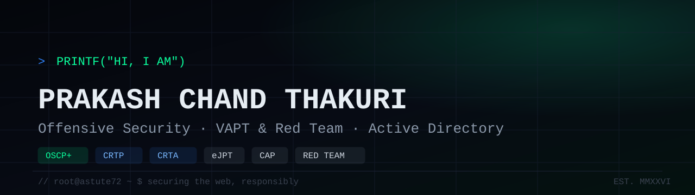

<p align="center">
  
</p>

---

### whoami

```text
role        : Senior Consultant — VAPT & Red Team Operations
employer    : Deloitte
focus       : Web · API · Mobile · Thick Client · Cloud · Active Directory
approach    : Full MITRE ATT&CK kill-chain
bug bounty  : 40+ organizations secured via responsible disclosure
certs       : OSCP+ · CRTP · CRTA · eJPT · CAP · Certified AI Security & Gov.
```

---

### Toolbox

<p align="center">
  
</p>

<p align="center">
  <b>Burp Suite</b> · <b>Caido</b> · <b>Nmap</b> · <b>Nuclei</b> · <b>sqlmap</b> · <b>ffuf</b> · <b>Metasploit</b> · <b>Hydra</b> · <b>Hashcat</b> · <b>BloodHound</b> · <b>Mimikatz</b> · <b>Wireshark</b>
</p>

---

### Certifications

- **OSCP+** — Offensive Security Certified Professional Plus
- **CRTP** — Certified Red Team Professional
- **CRTA** — Certified Red Team Analyst
- **eJPT** — Junior Penetration Tester
- **CAP** — Certified AppSec Practitioner
- **AI Security & Governance** — Certified Professional

---

### Connect

<p align="center">
  <a href="https://github.com/prakashchand72"></a>
  <a href="https://www.linkedin.com/in/prakashchand72"></a>
  <a href="https://twitter.com/prakashchand72"></a>
  <a href="https://astute72.vercel.app/"></a>
  
</p>
